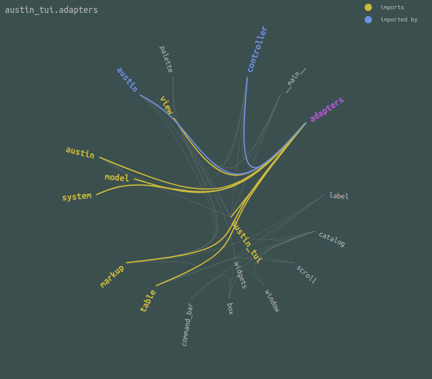

<h1 align="center">Betsy</h1>

<h3 align="center">The incy-wincy Python static dependencies crawler</h3>

# Synopsis

Betsy is a static dependency visualiser for Python packages. It generates a
hierarchical edge bundling chart as an HTML file, using JavaScript and D3.js.
This gives you an overview of all the dependencies between the sub-modules that
make up the content of the package. As packages grow in size, one might lose
track of what imports what. With Betsy you can make sure the architecture of
your Python packages stays in check and doesn't grow wild, with unwanted
backward dependencies, or even cyclic ones!

## Preview

    

## Installation

~~~ console
pipx install git+https://github.com/p403n1x87/betsy
~~~

## Usage

~~~ console
betsy -o mypackage.html /path/to/python/package
~~~

or, to automatically open the file in the browser after creation,

~~~ console
google-chrome $(betsy /path/to/python/package)
~~~
